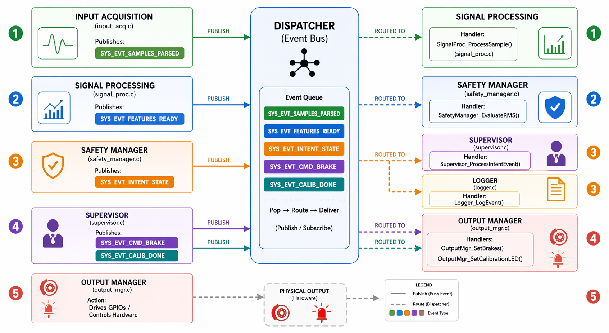

# EMG-EDA Brake Intent Detection

An embedded Event-Driven Architecture (EDA) system for detecting brake intent from Electromyography (EMG) signals. This firmware runs on the STM32F4 microcontroller and uses a decoupled Event-Driven Architecture to process raw sensor data into physical braking actions safely and reliably.

## System Architecture

This project adheres strictly to an Event-Driven Architecture using a Publish/Subscribe model. Individual modules are completely isolated from one another and do not invoke each other's functions. Instead, they communicate by posting `SystemEvent` data packages to a central `Dispatcher` queue.

### Core Pipeline
1. **Input Acquisition (`input_acq.c`)**: Listens to UART, extracts string frames from an ISR ring buffer, and converts them into floating-point EMG values.
2. **Signal Processing (`signal_proc.c`)**: Processes the raw EMG signal using O(1) running sums to calculate both an instantaneous (short-window) RMS and a smoothed (long-window) RMS.
3. **Safety Manager (`safety_manager.c`)**: Tracks the driver's resting noise via the long-window RMS to create a dynamic baseline threshold. When both the short and long windows spike above this threshold, a brake intent is detected.
4. **Supervisor (`supervisor.c`)**: Acts as the global state machine (Startup -> Idle -> Intent Confirmed -> Recovery). It ensures physical safety by enforcing a strict cooldown period when releasing the brakes, avoiding mechanical jitter.
5. **Output Manager (`output_mgr.c`)**: Actuates the physical brake calipers and status LEDs via GPIO pins.
6. **Logger (`logger.c`)**: Formats the system events into CSV strings and streams them out via UART for telemetry and debugging.
7. **Dispatcher (`dispatcher.c`)**: The central nervous system. It holds the FIFO event queue, continuously popping events and routing them to the correct module.

## Hardware Configuration
- **Microcontroller**: STM32F4 series (Configured for 168 MHz via HSE)
- **Telemetry / Input**: USART1 on `PB6` (TX) and `PB7` (RX) at 115200 Baud
- **Outputs**: `PD12` through `PD15` (Used for LEDs / Brake Relays)
- **Timing**: SysTick timer generates a 1ms tick for timeouts and the Supervisor state machine. Watchdog timer is configured for a 1-second reset window.

## Getting Started

### Prerequisites
- **IDE**: Keil µVision 5 (or compatible ARM Cortex-M environment)
- **Packages**: STM32F4xx Device Family Pack installed
- **Hardware**: An STM32F4 board (e.g., STM32F407G-DISC1) and an ST-Link programmer

### Build and Flash
1. Clone this repository to your local machine.
2. Double-click the `v1.uvprojx` file to open the project in Keil µVision.
3. Build the project by pressing `F7` (or selecting **Project > Build Target**).
4. Connect your STM32F4 board via USB.
5. Flash the firmware to the microcontroller by pressing `F8` (or selecting **Flash > Download**).
6. Once flashed, press the physical **RESET** button on the board to start the firmware.

### Usage / Simulation
To simulate an EMG signal:
1. Connect a USB-to-Serial adapter to `PB6` (TX), `PB7` (RX), and `GND`.
2. Open a Serial Terminal program (e.g., PuTTY, TeraTerm) configured to **115200 Baud, 8 Data Bits, 1 Stop Bit, No Parity**.
3. Feed float values terminated by a newline (`\n` or `\r`), e.g., `2.54\n`.
4. Monitor the returned CSV logs to see the system traverse through parsing, DSP, intent detection, and brake actuation.

## Team Responsibilities

| Team Member | Module | Responsibility |
| :--- | :--- | :--- |
| **Mukthish** | Supervisor | UML State Machine / Logic Authority |
| **Devansh** | Input Acq | Data Parsing & Hardware Interfacing |
| **Mahesh** | Signal Proc | DSP Filters, Windowing & Feature Extraction |
| **Bhagavath** | Safety | Dynamic Thresholding & Fault Gating |
| **Abhishek** | Output | GPIO Actuation & Immutable Logging |
